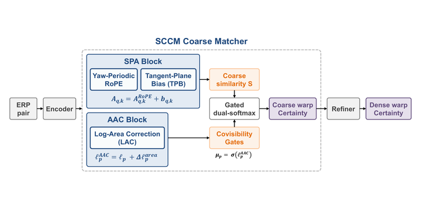
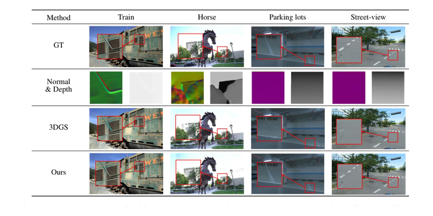

# Gyeonggwan Lee

**3D Vision Research Engineer** 
Dense matching &nbsp;·&nbsp; 360° vision &nbsp;·&nbsp; 3D reconstruction

   

I study how to find reliable correspondences in 360° panoramas and how to turn them into accurate 3D —
dense feature matching, structure-from-motion, and 3D Gaussian Splatting.

**Research interests** &nbsp;·&nbsp; Dense Matching &nbsp;·&nbsp; 360° / ERP Vision &nbsp;·&nbsp; Structure-from-Motion &nbsp;·&nbsp; 3D Gaussian Splatting &nbsp;·&nbsp; SLAM

## News

- **2026.09** — Code, models and project pages released for **SCCM** and **PDIGS**
- **2026.09** — **SCCM** accepted to **ACCV 2026**
- **2026.07** — **PRISM-SLAM** presented at the ICML 2026 SPIGM Workshop
- **2025.04** — **Oral** presentation at ISPRS Geospatial Week 2025

## Publications

<table>
<tr>
<td width="340" align="center" valign="middle"></td>
<td valign="middle">
<b>SCCM: Spherically Consistent Coarse Matching for ERP Dense Feature Correspondence</b> 
<b><u>Gyeonggwan Lee</u></b>, Eunsoo Im, Seunghwan Hong, Junghun Suh 
<b><i>ACCV 2026</i></b> 
<a href="https://gandanlee.github.io/sccm/">Project</a> | <a href="https://github.com/gandanlee/sccm">Code</a> | <a href="https://huggingface.co/gandan-lee/sccm">Models</a>  
Corrects the topological, metric and area distortions of 360° images inside coarse matching.
</td>
</tr>
<tr>
<td width="340" align="center" valign="middle"></td>
<td valign="middle">
<b>Prior-Driven Enhancements in 3D Gaussian Splatting: Normals and Depths Regularization</b> 
<b><u>Gyeonggwan Lee</u></b>, Seunghwan Hong, Junghun Suh 
<b><i>ISPRS Geospatial Week 2025</i></b> · <b>Oral</b> 
<a href="https://gandanlee.github.io/pdigs/">Project</a> | <a href="https://github.com/gandanlee/pdigs">Code</a> | <a href="https://huggingface.co/gandan-lee/pdigs">Models</a> | <a href="https://doi.org/10.5194/isprs-archives-XLVIII-G-2025-891-2025">Paper</a>  
Regularizes 3DGS with surface-normal and dense-depth priors for cleaner geometry.
</td>
</tr>
</table>

- **PRISM-SLAM: Probabilistic Ray-Grounded Inference for Scale-aware Metric SLAM** — Eunsoo Im, <u>Gyeonggwan Lee</u>, Seunghwan Hong, Junghun Suh · *ICML 2026 Workshop (SPIGM)* · [arXiv](https://arxiv.org/abs/2605.19257)

## Tools

    
